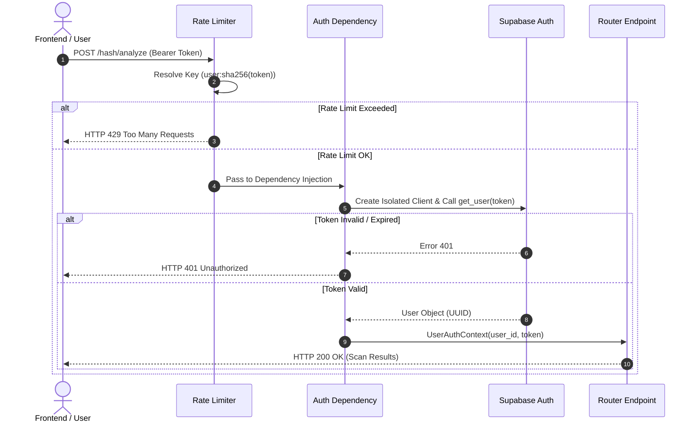
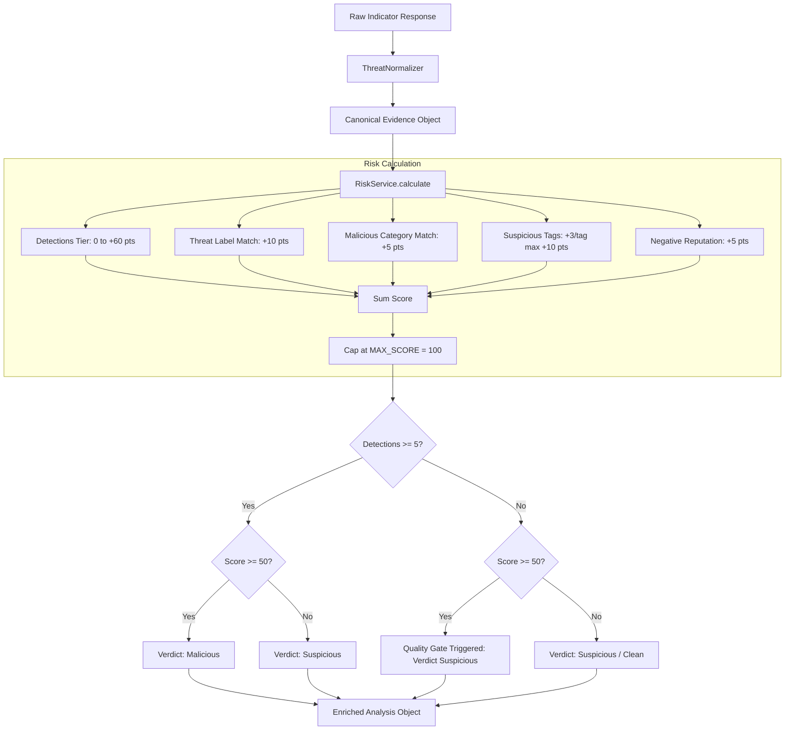

# SHADOW V1 — Security, Authentication & Risk Engine Study Guide

> **Educational Reference & Architectural Guide**  
> *A comprehensive guide covering Request-Scoped Multi-User Authentication, Deterministic Risk Scoring, System Security Audits, and Rate Limiting Architecture in FastAPI & Supabase.*

---

## Table of Contents
1. [System Architecture Overview](#1-system-architecture-overview)
2. [Module 1: Request-Scoped Auth & Multi-User Isolation](#module-1-request-scoped-auth--multi-user-isolation)
3. [Module 2: The Deterministic Risk Engine](#module-2-the-deterministic-risk-engine)
4. [Module 3: Security Audit & Attack Surface Analysis](#module-3-security-audit--attack-surface-analysis)
5. [Module 4: Backend Rate Limiting & DoS Protection](#module-4-backend-rate-limiting--dos-protection)
6. [Module 5: Architectural Flowcharts (Mermaid Diagrams)](#module-5-architectural-flowcharts-mermaid-diagrams)
7. [Module 6: Summary & Quick Review Notes](#module-6-summary--quick-review-notes)

---

## 1. System Architecture Overview

SHADOW is a modern threat intelligence platform built to analyze files, hashes, URLs, IP addresses, and domains. It integrates threat feeds (e.g. VirusTotal), runs deterministic risk analysis, and presents threat reports to users.

```
┌────────────────────────────────────────────────────────────────────────┐
│                        FRONTEND (React SPA)                            │
└──────────────────────────────────┬─────────────────────────────────────┘
                                   │  HTTP Requests (Bearer JWT / x-guest-mode)
                                   ▼
┌────────────────────────────────────────────────────────────────────────┐
│                        BACKEND (FastAPI)                               │
│  ├─ Rate Limiter (SlowAPI / ShadowLimiter)                             │
│  ├─ Authentication Dependency (get_current_user_context)              │
│  ├─ Routers (/files, /hash, /url, /domain, /ip, /shadow-ai)            │
│  ├─ Analysis Pipeline (RiskEngine, ConfidenceEngine, ReportEngine)      │
│  └─ Threat Gateway (VirusTotal / Provider Integrations)                │
└──────────────────────────────────┬─────────────────────────────────────┘
                                   │  Request-Scoped Supabase Client
                                   ▼
┌────────────────────────────────────────────────────────────────────────┐
│                  SUPABASE (Auth, PostgreSQL DB, RLS, Storage)          │
└────────────────────────────────────────────────────────────────────────┘
```

---

## Module 1: Request-Scoped Auth & Multi-User Isolation

### 1.1 The Global Singleton Anti-Pattern
In server-side Python applications using client SDKs (like Supabase Python SDK), a common architectural bug is instantiating a single **global client singleton**:

```python
# ❌ INSECURE ANTI-PATTERN (Global Client Singleton)
supabase: Client = create_client(SUPABASE_URL, SUPABASE_KEY)
```

**Why it fails in multi-user applications**:
1. When User A logs out, calling `supabase.auth.sign_out()` revokes the session globally on the remote authentication server.
2. The client's internal session storage (`_storage`) is shared across all concurrent web server threads/coroutines.
3. User B's subsequent requests trigger `HTTP 401: Session from session_id claim in JWT does not exist`.

### 1.2 The Request-Scoped Fix
To ensure zero cross-tenant session leakage, the backend instantiates a **fresh, isolated Supabase client for each incoming HTTP request**:

```python
# ✅ SECURE PATTERN (Request-Scoped Client Instantiation)
def get_supabase_client(access_token: str = None) -> Client:
    headers = {}
    if access_token:
        headers["Authorization"] = f"Bearer {access_token}"
    return create_client(SUPABASE_URL, SUPABASE_KEY, options=ClientOptions(headers=headers))
```

### 1.3 FastAPI Dependency Pattern
```python
async def get_current_user_context(
    credentials: HTTPAuthorizationCredentials = Depends(security)
) -> UserAuthContext:
    token = credentials.credentials
    # Create isolated request client
    client = get_supabase_client(token)
    user_response = client.auth.get_user(token)
    return UserAuthContext(
        user_id=user_response.user.id,
        access_token=token,
        is_guest=False
    )
```

**Key Security Properties**:
- **Identity Trust Boundary**: `user_id` is extracted strictly from backend-verified JWT tokens, never trusted from client-supplied HTTP bodies or headers.
- **Row-Level Security (RLS)**: Every database query appends `.eq("user_id", user_ctx.user_id)`.
- **Stateless Logout**: Calling `/auth/logout` calls `client.auth.admin.sign_out(user_ctx.access_token)` on the caller's specific token, leaving all other active user sessions untouched.

---

## Module 2: The Deterministic Risk Engine

### 2.1 Architecture & Principles
The SHADOW Risk Engine ([`backend/services/risk_service.py`](file:///c:/Users/physi/Documents/Codex/2026-06-22/hi/shadow/backend/services/risk_service.py)) is a **100% deterministic, pure Python heuristic calculator**.

**Core Engineering Principles**:
1. **Zero AI Hallucination in Scoring**: LLMs/AI do NOT calculate, influence, or override numerical scores.
2. **Provider Separation**: Threat intelligence evidence (VirusTotal detections) is normalized before scoring.
3. **Quality Gates**: High numerical scores cannot issue a `malicious` verdict without consensus detection agreement.

### 2.2 Complete Scoring Rule Matrix

$$\text{Final Score} = \min\left( \sum \text{Rule Points}, \, 100 \right)$$

| Category | Points | Condition | Field Examined |
|---|---|---|---|
| **Detections (Tier 5)** | **+60** | $\ge 11$ engines flagged indicator | `normalized["detections"]` |
| **Detections (Tier 4)** | **+40** | $5 - 10$ engines flagged indicator | `normalized["detections"]` |
| **Detections (Tier 3)** | **+20** | $3 - 4$ engines flagged indicator | `normalized["detections"]` |
| **Detections (Tier 2)** | **+10** | $2$ engines flagged indicator | `normalized["detections"]` |
| **Detections (Tier 1)** | **+5** | $1$ engine flagged indicator | `normalized["detections"]` |
| **Threat Label** | **+10** | Non-empty label string present | `normalized["threat_label"]` |
| **Malicious Category** | **+5** | Category matches `MALICIOUS_CATEGORIES` | `normalized["threat_categories"]` |
| **Suspicious Tags** | **+3 / tag** | Tags match `SUSPICIOUS_TAGS` (Max 10 pts) | `normalized["tags"]` |
| **Negative Reputation** | **+5** | Reputation score $< 0$ | `normalized["reputation"]` |

*Theoretical Maximum Sum across all rules = 60 + 10 + 5 + 10 + 5 = **90 points**.*

### 2.3 Quality Gates & Verdict Resolution

```python
# 1. Clean Safety Condition
if clean_conditions_met and score < 20:
    verdict, severity = "clean", "low"

# 2. Malicious Verdict (Requires Consensus >= 5 Detections)
elif detections >= 5 and score >= 80:
    verdict, severity = "malicious", "critical"
elif detections >= 5 and score >= 50:
    verdict, severity = "malicious", "high"

# 3. Quality Gate Downgrade (High Score, Insufficient Consensus)
elif score >= 50 and detections < 5:
    verdict = "suspicious"  # Downgraded from malicious!
    severity = "high"
    gate_applied = True
    gate_reason = f"Score ({score}) meets malicious threshold but only {detections} engine(s) flagged it (minimum 5 required)."
```

---

## Module 3: Security Audit & Attack Surface Analysis

### 3.1 Audit Findings Summary

| Severity | Count | Primary Areas Identified | Remediation Status |
|---|---|---|---|
| **CRITICAL** | 0 | None | N/A |
| **HIGH** | 1 | Missing Backend Rate Limiting (`SEC-HIGH-01`) | **RESOLVED** (SlowAPI) |
| **MEDIUM** | 3 | Missing HTTP Security Headers, Exception Exposure, Report Payload Size | Identified & Documented |
| **LOW** | 4 | Pydantic `max_length` bounds, CORS environment config, UTC deprecation | Identified & Documented |
| **INFO** | 3 | API `/docs` exposure in production, AI System Prompt lock | Verified Safe |

### 3.2 Key Security Controls in SHADOW
1. **IDOR Protection**: All scan queries filter by verified `user_id` (`.eq("id", scan_id).eq("user_id", user_ctx.user_id)`).
2. **File Upload Security**: Uploaded files generate cryptographically random UUID basenames. Original user-supplied filenames are never used as disk paths.
3. **Execution Prevention**: Files are opened strictly in binary read mode (`rb`) for static hashing and inspection. Uploaded files are **never executed**.
4. **AI Prompt Lock**: Shadow AI uses a 2-layer guardrail system (System Prompt Role Lock + Output Regex Filter) preventing role-hijacking or score override attempts.

---

## Module 4: Backend Rate Limiting & DoS Protection

### 4.1 Architecture & SlowAPI Integration
Rate limiting protects third-party API keys (VirusTotal & Groq) and server availability against API abuse.

```python
# backend/dependencies/rate_limiter.py
def get_rate_limit_key(request: Request) -> str:
    auth = request.headers.get("authorization", "")
    if auth.lower().startswith("bearer "):
        token = auth[7:].strip()
        if token:
            # Authenticated Users: Keyed by Token SHA-256 Hash
            return f"user:{hashlib.sha256(token.encode('utf-8')).hexdigest()[:16]}"
    
    # Guests / Unauthenticated: Keyed by Client IP
    return f"ip:{get_remote_address(request)}"
```

### 4.2 Rate Threshold Schedule

| Endpoint Group | Rate Limit | Key Strategy | Purpose |
|---|---|---|---|
| **File Uploads** (`/files/upload`) | **5 / min** | User / IP | Protect disk space & heavy CPU metadata processing |
| **Indicator Analysis** (`/hash`, `/url`, `/domain`, `/ip`) | **10 / min** | User / IP | Protect VirusTotal API quota |
| **Shadow AI Chat** (`/api/shadow-ai/chat`) | **20 / min** | User / IP | Protect Groq LLM API quota |
| **Authentication** (`/auth/login`, `/register`) | **5 / min** | Client IP | Prevent credential brute-force attacks |
| **Health Check** (`/health`) | **Unthrottled** | N/A | Maintain load balancer uptime polling |

### 4.3 HTTP 429 Response Format
```http
HTTP/1.1 429 Too Many Requests
Content-Type: application/json
Retry-After: 60

{
  "detail": "Rate limit exceeded. Please try again later."
}
```

---

## Module 5: Architectural Flowcharts (Mermaid Diagrams)

### 5.1 Request-Scoped Authentication Flow



### 5.2 Deterministic Risk Engine Pipeline



---

## Module 6: Summary & Quick Review Notes

### Quick Study Flashcards

1. **Q: Why should you avoid global Supabase client singletons in backend APIs?**  
   *A: Because global clients share mutable auth session state (`_storage`). Calling `sign_out()` on a global client revokes the session on the auth server for ALL concurrent users.*

2. **Q: How does SHADOW ensure User A cannot view User B's scan reports (IDOR)?**  
   *A: By extracting `user_id` strictly from backend-verified JWT tokens and enforcing `.eq("id", scan_id).eq("user_id", user_ctx.user_id)` on every database query.*

3. **Q: What is the Quality Gate in SHADOW's Risk Engine?**  
   *A: A safety rule requiring at least 5 security engine detections before issuing a `malicious` verdict, preventing false positives from single noisy engines.*

4. **Q: How does rate limiting distinguish between authenticated users and guests?**  
   *A: Authenticated requests are keyed by `user:<sha256(token)>` (so User A's limit is isolated from User B), while guest requests are keyed by `ip:<client_ip>`.*

5. **Q: Does AI calculate or override risk scores in SHADOW?**  
   *A: No. AI is 100% read-only and downstream from the deterministic Risk Engine. System prompt locks and output regex filters prevent AI score overrides.*
